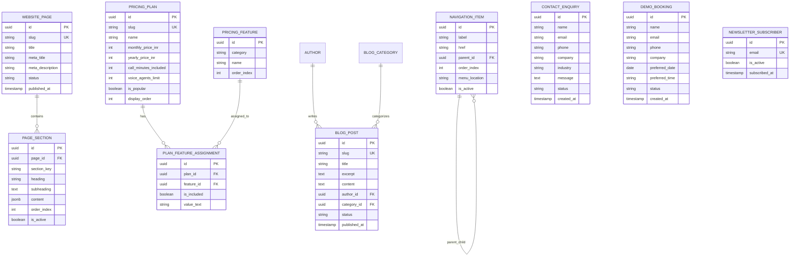

# ER_DIAGRAM.md — TalkNex Entity Relationship Diagram

```mermaid
erDiagram
    WEBSITE_PAGE ||--o{ PAGE_SECTION : contains
    WEBSITE_PAGE {
        uuid id PK
        string slug UK
        string title
        string meta_title
        string meta_description
        string status
        timestamp published_at
    }

    PAGE_SECTION {
        uuid id PK
        uuid page_id FK
        string section_key
        string heading
        text subheading
        jsonb content
        int order_index
        boolean is_active
    }

    NAVIGATION_ITEM ||--o{ NAVIGATION_ITEM : parent_child
    NAVIGATION_ITEM {
        uuid id PK
        string label
        string href
        uuid parent_id FK
        int order_index
        string menu_location
        boolean is_active
    }

    PRICING_PLAN ||--o{ PLAN_FEATURE_ASSIGNMENT : has
    PRICING_FEATURE ||--o{ PLAN_FEATURE_ASSIGNMENT : assigned_to
    PRICING_PLAN {
        uuid id PK
        string slug UK
        string name
        int monthly_price_inr
        int yearly_price_inr
        int call_minutes_included
        int voice_agents_limit
        boolean is_popular
        int display_order
    }

    PRICING_FEATURE {
        uuid id PK
        string category
        string name
        int order_index
    }

    PLAN_FEATURE_ASSIGNMENT {
        uuid id PK
        uuid plan_id FK
        uuid feature_id FK
        boolean is_included
        string value_text
    }

    AUTHOR ||--o{ BLOG_POST : writes
    BLOG_CATEGORY ||--o{ BLOG_POST : categorizes
    BLOG_POST {
        uuid id PK
        string slug UK
        string title
        text excerpt
        text content
        uuid author_id FK
        uuid category_id FK
        string status
        timestamp published_at
    }

    CONTACT_ENQUIRY {
        uuid id PK
        string name
        string email
        string phone
        string company
        string industry
        text message
        string status
        timestamp created_at
    }

    DEMO_BOOKING {
        uuid id PK
        string name
        string email
        string phone
        string company
        date preferred_date
        string preferred_time
        string status
        timestamp created_at
    }

    NEWSLETTER_SUBSCRIBER {
        uuid id PK
        string email UK
        boolean is_active
        timestamp subscribed_at
    }
```

